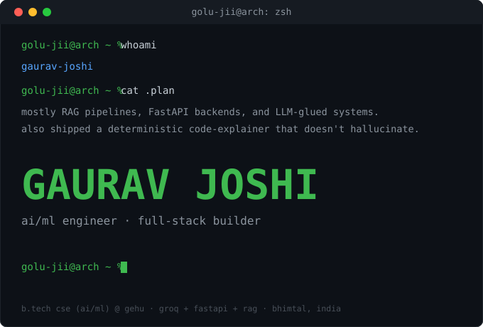

<div align="center">
  
</div>

<br>

## `~/architecture-stack`

| Layer | Production Technologies |
| :--- | :--- |
| **Core Logic** |    |
| **AI & Vector** |    |
| **Data & ORM** |    |
| **Client UI** |    |
| **DevOps** |    |

<br>

## `~/sprints --active`

```zsh
[DATA]    Mastering classical relational normalization: PostgreSQL + raw SQL join mechanics
[WORK]    AI Engineering Intern @ GridSphere (Interactive Client-Side Simulation Ops)
```

<br>

## `~/shipped --production`

### `[01]` [CODE Sherpa](https://code-sherpa-mu.vercel.app/) `:: Codebase Ground-Truth Q&A Engine`

> Engineered to eliminate LLM code hallucination by pairing **deterministic Python AST analysis** with Groq LLM narration. 

* **Architecture:** Asynchronous FastAPI ingestion backend paired with hybrid chunking (file-level + function-level) and ChromaDB semantic fallback.
* **The Refactor:** Re-architected blocking endpoints to `FastAPI BackgroundTasks` with job-polling, resolving ChromaDB lifespan init deadlocks and runtime crashes.
* **STDOUT:** `[` **[ GitHub ](https://github.com/GoLu-Jii/CODE_Sherpa)** `]` `|` `[` **[ Live Demo ](https://youtu.be/iz0Rq9VYDA4)** `]`

<br>

### `[02]` [PDF-RAG-APP](https://huggingface.co/spaces/Joshijii/PDF-RAG-APP) `:: Citation-Enforced Document Intelligence`

> Production-grade PDF parsing system engineered to return verifiable chunk-level source tags and score-threshold filtering per API call.

* **Pipeline:** LangChain chunking → SentenceTransformer embeddings → Qdrant Cloud Vector Search → Groq LLaMA-3.3-70B.
* **DevOps:** Fully containerized backend via Docker, deployed natively on Hugging Face Spaces serving a static frontend via FastAPI.
* **STDOUT:** `[` **[ Space Demo ](https://huggingface.co/spaces/Joshijii/PDF-RAG-APP)** `]` `|` `[` **[ GitHub ](https://github.com/GoLu-Jii/PDF-RAG-APP)** `]`

<br>

### `[03]` [GoPro-Deblur-Net] `:: Deep Learning Image Restoration` *(Active Sprint)*

> Custom Computer Vision architecture utilizing the GoPro Dataset to restore motion-blurred high-speed captures via deep neural feature extraction.

* **Objective:** Building raw deep learning model weights to run inference without relying on external third-party Vision APIs.
* **Status:** `[ Architecture & feature extraction branch active ]`

<br>

## `~/connect`

```zsh
❯ cat ~/.contacts.json

{
  "name": "Gaurav Joshi",
  "status": "Available for USD Remote / High-Impact AI Engineering Internships",
  "email": "gauravj121232@gmail.com",
  "github": "[https://github.com/GoLu-Jii](https://github.com/GoLu-Jii)",
  "linkedin": "[https://linkedin.com/in/gaurav-joshi](https://linkedin.com/in/gaurav-joshi)",
  "x_twitter": "[https://x.com/](https://x.com/)[https://x.com/GauravJ82092430]",
  "location": "Bhimtal / Dehradun, India (Willing to relocate globally)"
}
```
